  <picture>
    <source media="(prefers-color-scheme: dark) and (max-width: 600px)" srcset="./assets/hero-mobile-dark.svg" />
    <source media="(prefers-color-scheme: dark)" srcset="./assets/hero-dark.svg" />
    <source media="(max-width: 600px)" srcset="./assets/hero-mobile.svg" />
    
  </picture>

  <strong>Computer Science @ UT Austin · Software Engineer</strong> 
  Backend systems · cloud infrastructure · developer tooling

  <a href="https://gerardzhou.github.io">Portfolio</a> ·
  <a href="https://www.linkedin.com/in/gerard-zhou">LinkedIn</a> ·
  <a href="mailto:gerardzhou07@gmail.com">Email</a>

I build software across cloud infrastructure, Kubernetes platforms, backend APIs, and mobile products. My recent work spans release automation at Oracle Cloud Infrastructure, operator development at IBM, and production API systems for Soapbox.

## Technical stack

| | |
|---|---|
| **Languages** | Python · Go · Java · C++ · JavaScript · TypeScript · Bash · SQL · Terraform/HCL · YAML |
| **Frameworks & libraries** | React · React Native · Node.js · Express.js · Tailwind CSS · Hono |
| **Technologies** | Kubernetes · OpenShift · Terraform · Helm · PostgreSQL · MongoDB · REST APIs · AWS · Redis · Cloudflare |
| **Developer tools** | Linux · Docker · Operator SDK · OLM · Git/GitHub · Bitbucket · Jira · Postman · Figma · Maven |

## Personal Projects

| Project | Engineering focus | Stack |
|---|---|---|
| **QRmor** | Mobile QR workflow that checks destinations and summarizes link context before navigation. | React Native · TypeScript · Node.js · Express · VirusTotal · Gemini |
| **MobilizeUT** | Preference-aware campus routing for students with accessibility needs. | TypeScript · Hono · Cloudflare Workers · D1 · React Native |
| **STR-SUMO** | Traffic-simulation testbed for evaluating routing policies and deadline misses. | Python · SUMO · Dijkstra's algorithm · Q-learning |
| **CNN Image Classifier** | Convolutional model for binary image classification and ML experimentation. | Python · TensorFlow · Jupyter |
| **Real-Time Object Detection** | Webcam object-detection prototype built to explore computer-vision pipelines. | Python · OpenCV |

## Experience & research

| Organization | Technical scope | Core stack |
|---|---|---|
| **Oracle Cloud Infrastructure** · Software Engineer Intern | Designing release automation and isolated test environments for cloud infrastructure changes. | Terraform · CI/CD · infrastructure as code |
| **IBM** · Software Engineer Intern | Built a Kubernetes operator for enterprise software lifecycle management across OpenShift and Kubernetes. | Go · Operator SDK · Helm · OLM · Kubernetes |
| **Soapbox / Captain Fanplastic** · Software Engineer Intern | Shipped mobile features and 20+ authenticated API endpoints with database, mapping, and traffic controls. | React Native · Node.js · Express · PostgreSQL · Clerk · Redis · Google Maps API |
| **TRUCE Software** · Software Engineer Intern | Automated validation and expanded tests and static analysis across Python services. | Python · Pytest · AWS Lambda/SQS · Ruff · Mypy |
| **University of Houston** · Research | Evaluated routing policies in a SUMO traffic-simulation testbed. | Python · SUMO · Dijkstra's algorithm |

## GitHub activity

  <picture>
    <source media="(prefers-color-scheme: dark)" srcset="https://github-profile-summary-cards.vercel.app/api/cards/profile-details?username=GerardZhou&amp;theme=github_dark" />
    
  </picture>

  <picture>
    <source media="(prefers-color-scheme: dark)" srcset="https://github-profile-summary-cards.vercel.app/api/cards/repos-per-language?username=GerardZhou&amp;theme=github_dark" />
    
  </picture>

---

  <a href="mailto:gerardzhou07@gmail.com">gerardzhou07@gmail.com</a> ·
  <a href="https://gerardzhou.github.io">gerardzhou.github.io</a> ·
  <a href="https://www.linkedin.com/in/gerard-zhou">LinkedIn</a>

